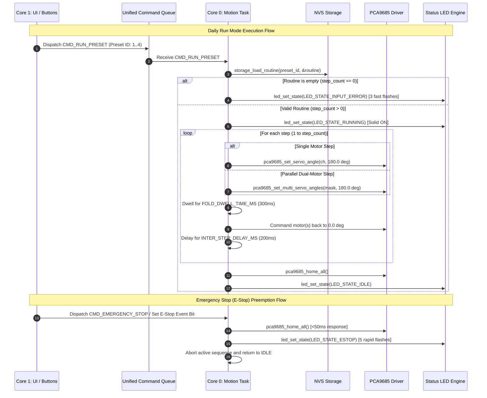

# Requirements — Phase 5: Motion Engine & Daily Run Mode Execution

## Scope

The Motion Engine & Daily Run Mode Execution subsystem provides the real-time motion control, step sequencing, and emergency safety mechanisms for the **Fabrica Cloth Folding Robot** on the **ESP32 Dev Board v1**.

### In-Scope Deliverables
1. **Core 0 Real-Time Motion Task** (`main/motion.h`, `main/motion.c`):
   - Dedicated FreeRTOS task pinned to Core 0 with priority 10.
   - Deterministic execution of sequential steps (Step 1 to $N$, up to 16 steps per routine).
   - Single motor sweep trajectory ($0^\circ \to 180^\circ \to 0^\circ$).
   - Synchronized parallel dual-motor sweep trajectory ($0^\circ \to 180^\circ \to 0^\circ$).
   - `FOLD_DWELL_TIME_MS` (300ms) dwell pause at peak fold angle.
   - `INTER_STEP_DELAY_MS` (200ms) settling pause between consecutive steps.
2. **Daily Run Mode Trigger Dispatcher**:
   - Short tap (<500ms) on B1–B4 triggers execution of Preset 1–4.
   - Routine loaded directly from NVS storage (`storage_load_routine()`).
   - Visual LED feedback binding (`LED_STATE_RUNNING` while active, `LED_STATE_IDLE` on completion).
3. **Safety & Protective Mechanisms**:
   - **Empty Preset Protection**: Tapping a button associated with an empty routine (0 steps) immediately triggers `LED_STATE_INPUT_ERROR` (3 fast flashes) and aborts without commanding servos.
   - **Emergency Stop (E-Stop)**: Tapping any button or dispatching `CMD_EMERGENCY_STOP` while motion is running immediately aborts active execution in $<50\text{ms}$, commands all 16 PCA9685 channels flat to $0^\circ$, sets `LED_STATE_ESTOP` (5 rapid flashes), and transitions motion status to `MOTION_STATUS_ABORTED`.
   - **Re-Entrancy / Busy Safeguard**: Rejects secondary run requests while motion is already active.
4. **Host Test Suite & Integration**:
   - Host test harness `firmware/test/test_motion.c` integrated into `Makefile`.
   - Complete integration in `firmware/main/main.c` and `firmware/main/CMakeLists.txt`.

---

## Decisions

1. **Direct Target Angle Actuation with RTOS Delays**:
   - Actuation uses direct target angle commands (`0^\circ \to 180^\circ \to 0^\circ`) via `pca9685_set_servo_angle()` and `pca9685_set_multi_servo_angles()`, relying on high-torque MG996R servo internal gear train and FreeRTOS tick timing (`vTaskDelay()`) for dwell and settling pauses.
2. **Core 0 Pinned Task Execution**:
   - The motion task executes on CPU Core 0, isolating real-time I2C actuation and motion timing from UI button debouncing, LED timer patterns, and NVS flash operations running on Core 1.
3. **Sub-50ms E-Stop Abort Polling**:
   - During long dwell pauses (e.g. 300ms fold dwell, 200ms inter-step delay), delays are executed in small slices (10ms to 20ms chunks) or via event group waits (`xEventGroupWaitBits`) to ensure E-Stop signals abort motion in $<50\text{ms}$.
4. **All-Channel Homing on Abort / Complete**:
   - On both clean completion and emergency abort, the motion engine commands all 16 PCA9685 channels to $0^\circ$ (`HOME_ANGLE_DEG`) to ensure all folding flaps rest flat.

---

## Constraints

| Parameter | Specification | Source / Rationale |
|---|---|---|
| **Target Microcontroller** | ESP32 Dev Board v1 (ESP-WROOM-32) | Hardware Constitution |
| **Motion Task Core** | CPU Core 0 | Dual-core RTOS partition (`tech-stack.md`) |
| **Motion Task Priority** | 10 (Highest application priority) | Deterministic real-time timing |
| **Motion Task Stack** | 4096 bytes | Internal DRAM budgeting |
| **Servo Angles** | Home: $0.0^\circ$, Fold: $180.0^\circ$ | `config.h` mechanical specifications |
| **Fold Dwell Time** | $300\text{ ms}$ (`FOLD_DWELL_TIME_MS`) | Fabric folding physics & crease settling |
| **Inter-Step Delay** | $200\text{ ms}$ (`INTER_STEP_DELAY_MS`) | Flap settling & mechanical inertia damping |
| **E-Stop Latency** | $< 50\text{ ms}$ | User safety & mechanical jam prevention |
| **Max Steps Per Routine**| 16 steps (`MAX_STEPS_PER_ROUTINE`) | Storage and memory architecture |
| **Max Motors Per Step** | 2 motors (`MAX_MOTORS_PER_STEP`) | Current draw & mechanical geometry |

---

## Non-goals

1. **Visual Staging Programming Mode**:
   - Programming mode state transitions, B1 cycle/nudge, B2 staging/holding, B3 step locking, and B4 saving to NVS are deferred to **Phase 6** (`state_machine.c`).
2. **Wireless BLE / Wi-Fi Execution**:
   - Wireless transport ingestion and mobile app synchronization are deferred to **Phase 8**.
3. **Servo Speed / Velocity Acceleration Profiles**:
   - Smooth multi-point S-curve or velocity ramping profiles are non-goals for Phase 5; direct target positioning is standard for MG996R servos.
4. **Current / Stall Sensing Feedback**:
   - Hardware does not include shunt current sensing; jam protection is achieved via operator E-Stop button press.

---

## Context & System Architecture

