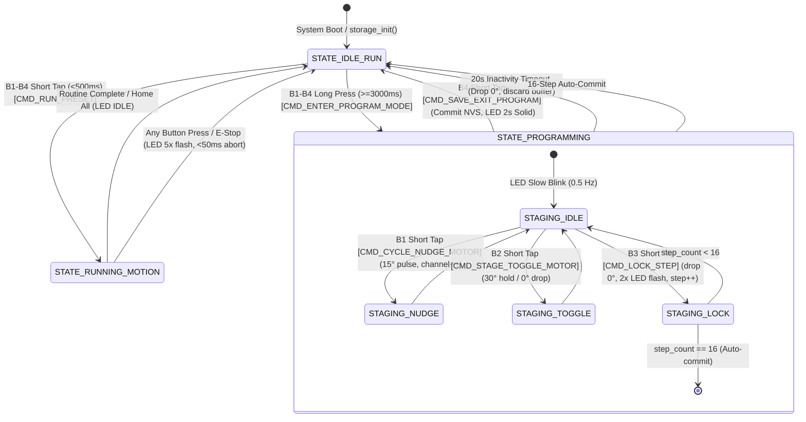
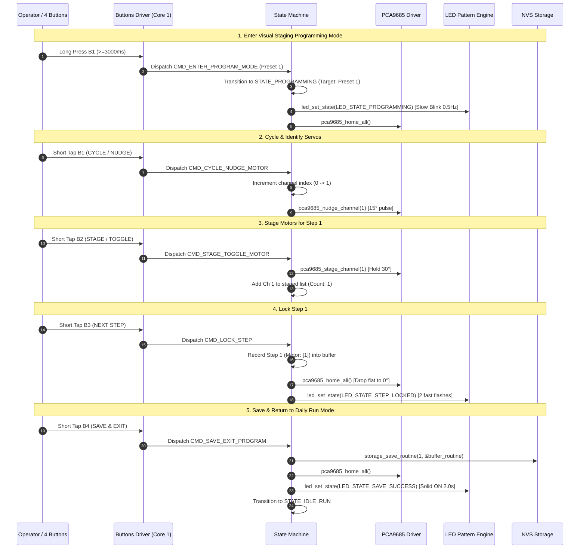

# Requirements — Phase 6: Visual Staging Programming Mode & State Machine Integration

## Scope

The Visual Staging Programming Mode & State Machine Integration subsystem provides computer-free, screen-free sequence creation, state coordination, and safety mechanisms for the **Fabrica Cloth Folding Robot** on the **ESP32 Dev Board v1**.

### In-Scope Deliverables
1. **Core State Machine Engine** (`main/state_machine.h`, `main/state_machine.c`):
   - Central coordinator managing `STATE_IDLE_RUN`, `STATE_RUNNING_MOTION`, and `STATE_PROGRAMMING`.
   - Context tracking for target preset ID (1–4), current servo channel cursor (0–15), staged motor list (max 2), temporary step buffer (up to 16 steps), and inactivity timer.
2. **Visual Staging Programming Workflow**:
   - **Mode Entry**: Long press (≥3000ms) on B1–B4 enters Programming Mode for that target preset; LED transitions to `LED_STATE_PROGRAMMING` (0.5 Hz slow blink).
   - **Channel Cycling & Nudge (B1)**: Increment selected servo channel (0 $\to$ 15, wrap to 0) and trigger physical $15^\circ$ identification pulse (`NUDGE_ANGLE_DEG`) via `pca9685_nudge_channel()`.
   - **Staging Toggle (B2)**: Toggle target servo between staged ($30^\circ$ hold, `STAGE_ANGLE_DEG`) and rest ($0^\circ$, `HOME_ANGLE_DEG`). Supports up to 2 simultaneously staged servos per step.
   - **Step Locking (B3)**: Commits currently staged servos (1 or 2) into sequence buffer, flashes LED twice (`LED_STATE_STEP_LOCKED`), drops staged flaps flat to $0^\circ$, and clears staging list for next step.
   - **Persistence & Exit (B4)**: Saves accumulated sequence to NVS Flash memory (`storage_save_routine()`), illuminates LED solid for 2.0s (`LED_STATE_SAVE_SUCCESS`), and returns to `STATE_IDLE_RUN`.
3. **Safety & Protective Mechanisms**:
   - **2-Motor Limit Rejection**: Attempting to stage a 3rd motor in a single step is blocked, triggering `LED_STATE_INPUT_ERROR` (3 fast flashes) while keeping the flap flat at $0^\circ$.
   - **Empty Step Skip**: Pressing B3 when 0 motors are staged is ignored or produces error feedback without advancing step buffer index.
   - **20-Second Inactivity Watchdog**: If no button presses occur for 20 seconds during Programming Mode, drops all servos flat to $0^\circ$, discards uncommitted buffer, and safely returns to `STATE_IDLE_RUN`.
   - **16-Step Maximum Cap**: Locking the 16th step automatically commits the routine to NVS storage and exits Programming Mode.
4. **Integration & Host Test Suite**:
   - Dynamic button event translation in `main/buttons.c` conditioned on system state.
   - Host test harness `firmware/test/test_state_machine.c` covering all transitions, gestures, staging rules, timeouts, and storage playback.
   - Integration with `main/main.c`, `main/CMakeLists.txt`, and `firmware/Makefile`.

---

## Decisions

1. **Dedicated State Machine Coordinator**:
   - State management is encapsulated in `state_machine.c`, decoupling UI gesture parsing (`buttons.c`) and motion execution (`motion.c`) from mode-dependent operational logic.
2. **0-Indexed Servo Channel Navigation**:
   - Internal channel indexing operates on standard 0–15 zero-indexed numbering aligned with the PCA9685 16-channel driver and `config.h` definitions.
3. **Flap Toggle Logic on B2**:
   - Tapping B2 on a previously unstaged channel adds it to the staged list and raises it to $30^\circ$. Tapping B2 again on an already-staged channel removes it from the list and lowers it to $0^\circ$.
4. **All-Channel Flattening on Step Lock & Exit**:
   - Calling `pca9685_home_all()` upon locking a step (B3), saving/exiting (B4), or timing out ensures all flaps return flat ($0^\circ$) before commencing next operations.
5. **Direct NVS Storage Persistence**:
   - Programming Mode writes directly to NVS via `storage_save_routine(preset_id, &buffer_routine)`, calculating IEEE 802.3 CRC32 checksums for immediate validation and instant recall in Daily Run Mode.

---

## Constraints

| Parameter | Specification | Source / Rationale |
|---|---|---|
| **Target Microcontroller** | ESP32 Dev Board v1 (ESP-WROOM-32) | Hardware Constitution |
| **Max Presets** | 4 presets (Presets 1–4) | 4 physical buttons B1–B4 |
| **Max Steps Per Routine** | 16 steps (`MAX_STEPS_PER_ROUTINE`) | Storage schema & RAM budget |
| **Max Motors Per Step** | 2 motors (`MAX_MOTORS_PER_STEP`) | Servo current draw & kinematics |
| **Total Servo Channels** | 16 channels (`TOTAL_SERVO_CHANNELS`) | PCA9685 16-channel driver |
| **Long Press Duration** | $\ge 3000\text{ ms}$ (`BUTTON_LONG_PRESS_MS`) | Distinguish Run vs Program gesture |
| **Inactivity Timeout** | $20000\text{ ms}$ (`PROGRAMMING_TIMEOUT_MS`) | Safety watchdog against abandoned mode |
| **Nudge Angle** | $15.0^\circ$ (`NUDGE_ANGLE_DEG`) | Visual and tactile motor identification |
| **Stage Hold Angle** | $30.0^\circ$ (`STAGE_ANGLE_DEG`) | Visible fold staging without fabric pinch |
| **Home Angle** | $0.0^\circ$ (`HOME_ANGLE_DEG`) | Flat panel resting position |

---

## Non-goals

1. **Wireless BLE / Wi-Fi Sequence Upload**:
   - Sequence creation over Bluetooth GATT or Wi-Fi WebSockets is deferred to **Phase 8**.
2. **Reverse Step Undo / Step Edit**:
   - Editing intermediate steps in a recorded sequence is not supported in the computer-free 4-button UI; users record from Step 1 or overwrite via a new programming session.
3. **Arbitrary Servo Angle Teaching**:
   - Variable fold angles per step (e.g. partial $90^\circ$ crease) are not exposed in standard Visual Staging; staging uses fixed $30^\circ$ hold and full $180^\circ$ fold articulation.
4. **Dynamic Motor Count Expansion Beyond 16**:
   - System strictly supports up to 16 PCA9685 channels on single I2C address `0x40`.

---

## Context & State Transition Architecture

