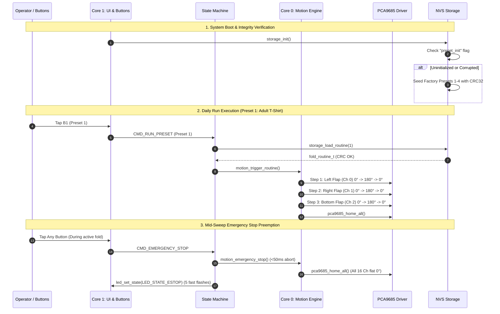

# Requirements — Phase 7: End-to-End System Validation, Stress Testing & Preset Library

## Scope

Phase 7 delivers comprehensive end-to-end system validation, stress testing, factory preset sequence refinement, and complete hardware/software documentation for the **Fabrica Cloth Folding Robot** on the **ESP32 Dev Board v1**.

### In-Scope Deliverables

1. **Standardized Factory Preset Library (`storage.c`)**:
   - Establish production folding choreography for 4 standard garment types:
     - **Preset 1 (Adult T-Shirt)**: 3-step sequence (Left flap $\to$ Right flap $\to$ Bottom flap).
     - **Preset 2 (Long-Sleeve Shirt)**: 4-step sequence (Parallel dual-sleeve fold $\to$ Left body fold $\to$ Right body fold $\to$ Bottom fold).
     - **Preset 3 (Trousers / Jeans)**: 2-step sequence (Vertical half fold $\to$ Bottom fold).
     - **Preset 4 (Towel / Linen)**: 3-step sequence (Left half fold $\to$ Right quarter fold $\to$ Bottom final fold).
   - Standardize physical servo flap mappings:
     - Channel 0: Left Side Flap (`SERVO_FLAP_LEFT`)
     - Channel 1: Right Side Flap (`SERVO_FLAP_RIGHT`)
     - Channel 2: Bottom Flap (`SERVO_FLAP_BOTTOM`)
     - Channel 3: Top / Collar Flap (`SERVO_FLAP_TOP`)
   - Pre-computed IEEE 802.3 CRC32 checksums for deterministic integrity validation upon factory boot and NVS seeding.

2. **Dedicated End-to-End Stress & Endurance Test Suite (`test/test_e2e_stress.c`)**:
   - **100-Cycle Endurance Execution**: Continuous, automated playback cycling through presets to verify zero memory leaks and heap stability.
   - **Mid-Sweep Emergency Stop Preemption**: Injection of `CMD_EMERGENCY_STOP` during active outward sweep, 300ms fold dwell, return sweep, and inter-step delays; verify all 16 channels drop to $0^\circ$ within $<50\text{ms}$.
   - **NVS Power-Loss & Flash Corruption Resilience**: Automated verification that single-bit and multi-bit data corruption in stored routine blobs triggers safe fallback to default routines (`ESP_ERR_INVALID_CRC`).
   - **Watchdog & Mode Invariant Stress**: Stress testing rapid mode toggling between Daily Run Mode, Visual Staging Mode, and E-Stop.

3. **System Documentation & Hardware Guides (`firmware/README.md`)**:
   - Complete pinout mapping and wiring diagram (ESP32 Dev Board v1, PCA9685, 4 push buttons, status LED, external servo power).
   - Dual-Core FreeRTOS architecture breakdown (Core 0 motion engine vs Core 1 UI/event loop).
   - Operator guide for Daily Run Mode and Visual Staging Programming Mode.
   - ESP-IDF build, flash, and serial monitor instructions.

---

## Decisions

1. **Physical Flap Geometry Standardization**:
   - Formalize 4-flap geometric configuration: Channel 0 (Left Flap), Channel 1 (Right Flap), Channel 2 (Bottom Flap), Channel 3 (Top Flap). This ensures standard 4-panel garment folding aligns with physical mechanical assemblies.
2. **Dual-Layer Validation Architecture**:
   - Combine automated host stress test harnesses (`make test`, validating 100 continuous cycles, heap tracking, and mid-sweep preemption) with structured manual verification checklists for live ESP32 hardware flashing.
3. **Zero Heap Leak Requirement**:
   - The firmware architecture uses static allocations for queues, tasks, and sequence buffers. The 100-cycle endurance test must prove zero dynamic allocation growth (`esp_get_minimum_free_heap_size()` stays flat).
4. **Autonomous Corruption Recovery**:
   - Corrupted NVS records must never halt or freeze the robot. Detection of invalid CRC32 checksums must gracefully fall back to factory presets and log diagnostic warnings.
5. **Separation of Concerns for Wireless Expansion**:
   - Maintain the decoupled command architecture (`command_t` and `cmd_source_t`) without adding BLE code in this phase, preserving $\ge 120\text{ KB}$ internal DRAM headroom for Phase 8.

---

## Constraints

| Constraint | Specification | Source / Rationale |
|---|---|---|
| **Target Hardware** | ESP32 Dev Board v1 (ESP-WROOM-32) | Hardware Constitution |
| **PWM Servo Driver** | PCA9685 over I2C (`GPIO 21 SDA`, `GPIO 22 SCL`) | Hardware Constitution |
| **Max Presets** | 4 Presets (Presets 1–4) | 4 physical tactile buttons B1–B4 |
| **Max Steps Per Routine** | 16 steps (`MAX_STEPS_PER_ROUTINE`) | Storage schema & RAM budget |
| **Max Motors Per Step** | 2 motors (`MAX_MOTORS_PER_STEP`) | Servo current draw & kinematics |
| **Emergency Stop Latency** | $< 50\text{ ms}$ from trigger to PWM abort | Safety requirement |
| **Servo Timing** | 300ms fold dwell, 200ms inter-step delay | Fabric settling mechanics |
| **SRAM Headroom** | $\ge 120\text{ KB}$ DRAM free | Reserved for Phase 8 BLE Mobile Integration |
| **NVS Integrity** | IEEE 802.3 CRC32 polynomial (`0xEDB88320`) | Bit-rot and power loss protection |

---

## Non-goals

1. **BLE Stack Implementation**:
   - Wireless transport implementation (NimBLE GATT server) is handled in **Phase 8**.
2. **Dynamic Calibration / Trim Offsets**:
   - Per-servo angle calibration via serial CLI is out of scope; standard servo PWM pulse boundaries ($500\,\mu\text{s} \to 2500\,\mu\text{s}$) are maintained.
3. **Dynamic Preset Count Expansion**:
   - The physical user interface remains anchored to 4 buttons and 4 NVS preset slots.
4. **Mechanical Hardware Modifications**:
   - Physical hinge or 3D CAD changes are managed under `cad-designs/`, not embedded firmware.

---

## Context & System Interaction

