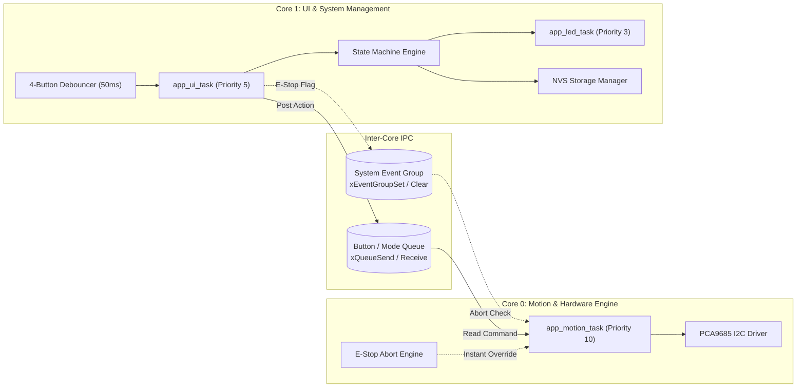
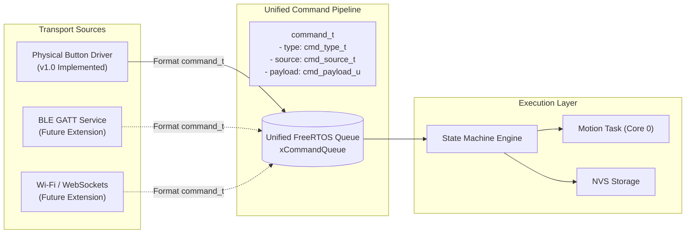

# Tech Stack — ESP32 Firmware

## Firmware Toolchain & Build System

| Layer | Tool / Standard | Details |
|---|---|---|
| **Framework / SDK** | Espressif ESP-IDF (v5.x / v6.x) | Native C / FreeRTOS development framework |
| **Language Standard** | C99 / C11 | High-efficiency embedded C with strict type definitions (`stdint.h`, `stdbool.h`) |
| **Target Microcontroller** | ESP32 Dev Board v1 / ESP-WROOM-32 | Dual-core Xtensa 32-bit LX6 @ 240 MHz, 520 KB SRAM, 4 MB SPI Flash |
| **Build System** | CMake 3.16+ & Ninja | Standard ESP-IDF build flow (`idf.py build`, `idf.py flash`, `idf.py monitor`) |
| **Reference Baseline** | `poc/esp_hello_world` | ESP-IDF structure, `esp_chip_info.h`, `esp_flash.h`, FreeRTOS tasks, `driver/gpio.h` |
| **Non-Volatile Storage** | ESP-IDF NVS Flash (`nvs_flash.h`) | Key-value sequence profile storage for Presets 1–4 across power cycles |
| **Communication Protocol** | I2C Master (`driver/i2c.h` / `driver/i2c_master.h`) | 50 Hz PWM servo bus driving PCA9685 @ 100 kHz standard / 400 kHz fast mode |
| **OS / RTOS** | FreeRTOS (ESP-IDF SMP port) | Preemptive dual-core task scheduling, queues, event groups, and software timers |

---

## ESP32 Dual-Core Architecture & Task Allocation



### Core 0 — Real-Time Motion & Actuation Engine
- **`app_motion_task` (Priority: 10, Core ID: 0)**:
  - Consumes motion execution commands from the inter-core queue.
  - Implements smooth single-servo and synchronized parallel dual-servo sweep trajectories ($0^\circ \rightarrow 180^\circ \rightarrow 0^\circ$).
  - Controls deterministic dwell delays (300ms fold dwell, 200ms inter-step delay) using `vTaskDelay()`.
  - Continuously samples the E-Stop abort event flag before and during step transitions.
- **PCA9685 I2C Driver**: Direct register reads/writes over ESP32 hardware I2C peripheral (`I2C_NUM_0`).

### Core 1 — UI, Event Loop & System Coordination
- **`app_ui_task` (Priority: 5, Core ID: 1)**:
  - Scans and debounces 4 physical push buttons with a 50ms software low-pass filter.
  - Differentiates between Short Tap (<500ms) and Long Press (≥3000ms).
  - Drives mode transitions between **Daily Run Mode** and **Visual Staging Mode**.
  - Handles the 20-second inactivity timeout in Programming Mode.
- **`app_led_task` (Priority: 3, Core ID: 1)**:
  - Non-blocking pattern generator translating abstract system states into precise visual pulse trains.
- **`storage` Subsystem**: Manages serialized read/write operations to ESP-IDF NVS flash memory.

---

## Hardware Pinout & Peripheral Configuration

### 1. GPIO Pin Allocations

| Signal Name | ESP32 GPIO | Direction | Configuration | Active State | Description |
|---|---|---|---|---|---|
| `PIN_STATUS_LED` | `GPIO_NUM_2` | Output | Push-Pull / No Pull | High (1) | Visual status indicator LED (Built-in on DevKit) |
| `PIN_BTN_1` | `GPIO_NUM_0` | Input | Internal Pull-Up (`GPIO_PULLUP_ONLY`) | Low (0) | B1: Preset 1 Routine / Cycle & Nudge Flap ($15^\circ$) |
| `PIN_BTN_2` | `GPIO_NUM_4` | Input | Internal Pull-Up (`GPIO_PULLUP_ONLY`) | Low (0) | B2: Preset 2 Routine / Stage & Toggle Flap ($30^\circ$) |
| `PIN_BTN_3` | `GPIO_NUM_16` | Input | Internal Pull-Up (`GPIO_PULLUP_ONLY`) | Low (0) | B3: Preset 3 Routine / Lock Step & Drop Flaps |
| `PIN_BTN_4` | `GPIO_NUM_17` | Input | Internal Pull-Up (`GPIO_PULLUP_ONLY`) | Low (0) | B4: Preset 4 Routine / Save to NVS & Exit |
| `PIN_I2C_SDA` | `GPIO_NUM_21` | I/O | Open-Drain + External/Internal Pull-Up | — | I2C Data line connected to PCA9685 SDA |
| `PIN_I2C_SCL` | `GPIO_NUM_22` | Output | Open-Drain + External/Internal Pull-Up | — | I2C Clock line connected to PCA9685 SCL |

### 2. PCA9685 PWM Driver Configuration

| Parameter | Value | Description |
|---|---|---|
| **I2C Port** | `I2C_NUM_0` | Hardware I2C controller |
| **I2C Address** | `0x40` | Default address (`A0–A5` grounded) |
| **I2C Clock Speed** | `100000` Hz (100 kHz) | Standard mode (supports 400 kHz fast mode) |
| **PWM Output Frequency** | `50` Hz | Standard 20ms period for analog/digital RC servos |
| **Prescale Value** | `121` (`0x79`) | $\text{Prescale} = \text{round}\left(\frac{25\text{ MHz}}{4096 \times 50\text{ Hz}}\right) - 1 = 121$ |
| **PWM Resolution** | 12-bit (4096 counts) | Range $0$ to $4095$ counts per 20ms frame |
| **Servo Min Pulse ($0^\circ$)** | $500\ \mu\text{s}$ ($\approx 102$ counts) | Flap resting flat on table ($0^\circ$ home) |
| **Servo Nudge Pulse ($15^\circ$)** | $667\ \mu\text{s}$ ($\approx 137$ counts) | Identification nudge angle |
| **Servo Staged Pulse ($30^\circ$)** | $833\ \mu\text{s}$ ($\approx 171$ counts) | Visual staging angle held on table |
| **Servo Fold Pulse ($180^\circ$)** | $2500\ \mu\text{s}$ ($\approx 512$ counts) | Full fold flip articulation |

---

## Core Software Libraries & ESP-IDF Drivers

1. **System & FreeRTOS**:
   - `esp_system.h`, `esp_chip_info.h`, `esp_flash.h`: System telemetry, heap monitoring, chip diagnostics (referencing `hello_world_main.c`).
   - `freertos/FreeRTOS.h`, `freertos/task.h`, `freertos/queue.h`, `freertos/event_groups.h`, `freertos/timers.h`.
2. **GPIO Driver**:
   - `driver/gpio.h`: Pin resets, direction configuration, pull-up resistors, and state reading (referencing `blink_led.c`).
3. **I2C Master Driver**:
   - `driver/i2c.h` / `driver/i2c_master.h`: Bus initialization, write commands, and register configuration for the PCA9685 controller.
4. **NVS Flash Storage**:
   - `nvs_flash.h`, `nvs.h`: Partition initialization, key-value blob read/write operations for multi-step folding sequences.
5. **Logging & Debugging**:
   - `esp_log.h`: Structured logging with distinct module tags (`MAIN`, `BUTTONS`, `LED`, `PCA9685`, `MOTION`, `STORAGE`, `SM`).

---

## System Timing & Configuration Constants (`config.h`)

| Constant | Value | Description |
|---|---|---|
| `MAX_STEPS_PER_ROUTINE` | `16` | Maximum steps allowable per folding preset routine |
| `MAX_MOTORS_PER_STEP` | `2` | Maximum servos allowed to fold synchronously in 1 step |
| `TOTAL_SERVO_CHANNELS` | `16` | Total physical servo channels on the PCA9685 driver |
| `BUTTON_DEBOUNCE_MS` | `50` ms | Low-pass debounce sampling window |
| `BUTTON_LONG_PRESS_MS` | `3000` ms | Continuous hold duration required to enter Programming Mode |
| `BUTTON_SHORT_PRESS_MAX_MS` | `500` ms | Upper bound for tap gesture detection in Daily Run Mode |
| `PROGRAMMING_TIMEOUT_MS` | `20000` ms | Inactivity timeout auto-exiting Programming Mode |
| `FOLD_DWELL_TIME_MS` | `300` ms | Dwell time holding flap at $180^\circ$ before returning |
| `INTER_STEP_DELAY_MS` | `200` ms | Settling delay between consecutive folding steps |
| `NUDGE_ANGLE_DEG` | `15.0f` | Motor identification sweep angle |
| `STAGE_ANGLE_DEG` | `30.0f` | Visual staging hold angle |
| `HOME_ANGLE_DEG` | `0.0f` | Flat panel rest position |
| `FOLD_ANGLE_DEG` | `180.0f` | Complete flap fold angle |

---

## Sequence Data Structures & NVS Storage Schema

```c
// Individual step containing 1 or 2 simultaneous servo motions
typedef struct {
    uint8_t motor_count;                     // Number of active motors (1 or 2)
    uint8_t motor_ids[MAX_MOTORS_PER_STEP];  // Zero-indexed servo IDs (0 to 15)
} fold_step_t;

// Complete routine sequence structure stored in NVS flash blob
typedef struct {
    uint8_t step_count;                      // Number of steps in sequence (1 to 16)
    fold_step_t steps[MAX_STEPS_PER_ROUTINE];// Array of sequence steps
    uint32_t checksum;                       // CRC32 integrity validation checksum
} fold_routine_t;

---

## Scalable Command Protocol & Transport Abstraction

To ensure the firmware seamlessly scales to support the mobile app in future releases without architectural redesign, all system events pass through a unified, source-agnostic command pipeline.



### 1. Unified Command Data Structure (`command.h`)

```c
typedef enum {
    SOURCE_PHYSICAL_BUTTON = 0,
    SOURCE_BLE,
    SOURCE_WIFI,
    SOURCE_INTERNAL_TIMER
} cmd_source_t;

typedef enum {
    CMD_RUN_PRESET = 0,         // Execute Preset (1 to 4)
    CMD_RUN_RAW_SEQUENCE,       // Execute temporary sequence payload directly
    CMD_EMERGENCY_STOP,         // Immediate E-Stop halt & home all servos
    CMD_ENTER_PROGRAM_MODE,     // Enter staging mode for a preset slot
    CMD_CYCLE_NUDGE_MOTOR,      // Increment target motor and trigger 15° identification nudge
    CMD_STAGE_TOGGLE_MOTOR,     // Lift target motor to 30° hold or drop to 0°
    CMD_LOCK_STEP,              // Commit staged motors to step buffer and drop flaps
    CMD_SAVE_EXIT_PROGRAM,      // Commit accumulated buffer to NVS flash and exit
    CMD_JOG_MOTOR_ANGLE,        // Live position jog (0° to 180°) for calibration
    CMD_GET_TELEMETRY,          // Request real-time operational status packet
    CMD_SYNC_PRESETS            // Bulk read/write all presets over wireless
} cmd_type_t;

typedef union {
    uint8_t preset_id;          // For CMD_RUN_PRESET, CMD_ENTER_PROGRAM_MODE (1 to 4)
    fold_routine_t raw_routine; // For CMD_RUN_RAW_SEQUENCE, CMD_SYNC_PRESETS
    struct {
        uint8_t channel;        // 0 to 15
        float angle_deg;        // 0.0 to 180.0
    } jog_param;                // For CMD_JOG_MOTOR_ANGLE
} cmd_payload_t;

typedef struct {
    cmd_type_t type;
    cmd_source_t source;
    cmd_payload_t payload;
} command_t;
```

### 2. Transport Interface Contract (`transport.h`)

```c
// Pluggable transport abstraction interface for physical & future wireless links
typedef struct {
    esp_err_t (*init)(void);
    esp_err_t (*send_telemetry)(const void *telemetry_data, size_t len);
    esp_err_t (*broadcast_event)(uint8_t event_code);
} transport_interface_t;
```

---

## Future Wireless Specifications (BLE & Wi-Fi) [Post-MVP Architecture]

### 1. Bluetooth Low Energy (BLE) GATT Architecture (Future Reference)
* **ESP-IDF BLE Stack**: NimBLE (or Bluedroid) operating on Core 1.
* **Custom GATT Primary Service UUID**: `0000FAB0-0000-1000-8000-00805F9B34FB` (Fabrica Service)
  * **Control Point Characteristic (`FAB1`)**: Write Without Response / Write with ACK — Ingests binary/JSON `command_t` packets from mobile app.
  * **Telemetry Characteristic (`FAB2`)**: Notify / Read — Streams live robot state (Current Mode, Active Step, Flap Angles, E-Stop status) at 10 Hz.
  * **Sequence Profile Transfer Characteristic (`FAB3`)**: Read / Write — High-throughput MTU (up to 512 bytes) for uploading/downloading complete `fold_routine_t` presets.

### 2. Wi-Fi & Local WebSockets Architecture (Future Reference)
* **Modes**: Wi-Fi Station (joining home network) with SoftAP fallback for initial provisioning.
* **WebSockets Server**: Lightweight async WebSocket server dispatching bidirectional JSON RPC frames:
  ```json
  {"cmd": "RUN_PRESET", "preset": 1}
  {"cmd": "JOG", "motor": 2, "angle": 45.0}
  {"cmd": "SYNC_PROFILE", "preset": 2, "routine": {"steps": [[0], [1, 2], [3]]}}
  ```

### 3. Memory & Resource Budgeting for Wireless Scaling
* **SRAM Allocation**: Ensure initial v1.0 firmware leaves $\ge 120\text{ KB}$ of internal DRAM free for future BLE / Wi-Fi stack activation.
* **Task Stacks**: Size initial FreeRTOS task stacks conservatively (e.g. `app_ui_task`: 4KB, `app_motion_task`: 4KB) with heap monitoring via `esp_get_minimum_free_heap_size()`.

---

## File & Directory Structure

```
firmware/
├── specs/                          ← Project specifications (mission.md, tech-stack.md, roadmap.md, requirements.md)
├── CMakeLists.txt                  ← Root ESP-IDF project CMake file
├── Makefile                        ← Legacy GNU Make / helper entrypoint
├── sdkconfig.defaults              ← Default SDK configuration (240MHz, 1000Hz tick, 4MB flash)
├── main/                           ← Main firmware component
│   ├── CMakeLists.txt              ← Component source registration
│   ├── main.c                      ← System initialization, chip diagnostics, task bootstrap
│   ├── config.h                    ← Single source of truth for pinouts, timings, limits
│   ├── command.h                   ← Unified source-agnostic command protocol & event structures
│   ├── buttons.h / buttons.c       ← 4-button debouncing & gesture recognition (Tap vs Hold)
│   ├── led.h / led.c               ← Non-blocking multi-pattern LED controller engine
│   ├── pca9685.h / pca9685.c       ← I2C Master driver for PCA9685 16-channel PWM generator
│   ├── motion.h / motion.c         ← Real-time motion execution task, trajectory delays, E-Stop
│   ├── storage.h / storage.c       ← ESP-IDF NVS flash manager for Presets 1–4 persistence
│   └── state_machine.h / .c        ← System state machine coordinating Run & Program modes
├── test/                           ← Host-based unit tests and mock hardware harness
└── README.md                       ← Build, flash, monitor instructions and hardware setup guide
```

