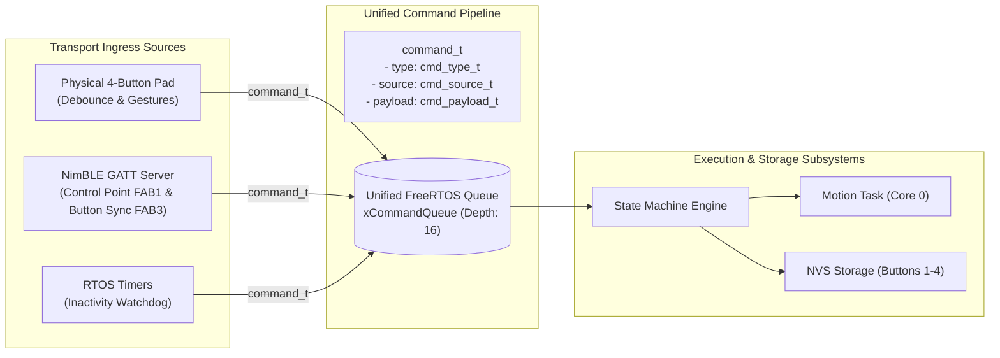

# Tech Stack — ESP32 Firmware

## Firmware Toolchain & Build System

| Layer | Tool / Standard | Details |
|---|---|---|
| **Framework / SDK** | Espressif ESP-IDF (v5.x / v6.x) | Native C / FreeRTOS development framework |
| **Language Standard** | C99 / C11 | High-efficiency embedded C with strict type definitions (`stdint.h`, `stdbool.h`) |
| **Target Microcontroller** | ESP32 Dev Board v1 / ESP-WROOM-32 | Dual-core Xtensa 32-bit LX6 @ 240 MHz, 520 KB SRAM, 4 MB SPI Flash |
| **Build System** | CMake 3.16+ & Ninja | Standard ESP-IDF build flow (`idf.py build`, `idf.py flash`, `idf.py monitor`) |
| **Reference Baseline** | `poc/esp_hello_world` | ESP-IDF structure, `esp_chip_info.h`, `esp_flash.h`, FreeRTOS tasks, `driver/gpio.h` |
| **Non-Volatile Storage** | ESP-IDF NVS Flash (`nvs_flash.h`) | Key-value blob sequence storage for 4 physical Button Routines (user-programmed & factory defaults) |
| **I2C Actuation Driver** | I2C Master (`driver/i2c.h` / `driver/i2c_master.h`) | Dedicated 100 kHz bus driving PCA9685 16-channel PWM servo controller (`0x40`) |
| **Wireless Stack** | Apache NimBLE (ESP-IDF Native) | Ultra-lightweight, dedicated BLE GATT server (`nimble/`) for mobile app integration |
| **OS / RTOS** | FreeRTOS (ESP-IDF SMP port) | Preemptive dual-core task scheduling, queues, event groups, and software timers |

---

## ESP32 Dual-Core Architecture & Task Allocation

```mermaid
graph LR
    subgraph Core 0 [Core 0: Motion & Hardware Bus Engine]
        direction TB
        M_TASK["app_motion_task (Priority 10)"]
        I2C_MGR["PCA9685 PWM Driver (I2C NUM 0)"]
        ESTOP_ISR["E-Stop Abort Engine (<50ms)"]
        M_TASK --> I2C_MGR
        ESTOP_ISR -.->|Instant Preemption| M_TASK
    end

    subgraph Core 1 [Core 1: UI, BLE Wireless & System Coordination]
        direction TB
        BLE_TASK["app_ble_task (Priority 4)<br/>NimBLE GATT Server"]
        TELEM_TASK["app_telem_task (Priority 3)<br/>10Hz Progress & Motor Telemetry"]
        UI_TASK["app_ui_task (Priority 5)<br/>4-Button Debouncer (50ms)"]
        SM_CORE["State Machine Engine"]
        NVS_CORE["NVS Sequence Manager (Buttons 1-4)"]
        LED_TASK["app_led_task (Priority 2)<br/>Status LED Engine"]

        BLE_TASK -->|Dispatched command_t| CMD_Q
        UI_TASK -->|Dispatched command_t| CMD_Q
        CMD_Q --> SM_CORE
        SM_CORE --> LED_TASK
        SM_CORE --> NVS_CORE
        TELEM_TASK -.->|Notify Progress & Angles (FAB2)| BLE_TASK
        NVS_CORE -.->|Notify Config Changes (FAB3)| BLE_TASK
    end

    subgraph IPC [Inter-Core IPC]
        CMD_Q[("Unified Command Queue<br/>xCommandQueue (Depth: 16)")]
        STATE_GRP[("System Event Group<br/>xSystemEventGroup")]
    end

    SM_CORE -->|Trigger Motion| M_TASK
    UI_TASK -.->|E-Stop Flag| STATE_GRP
    BLE_TASK -.->|Wireless E-Stop / Stop| STATE_GRP
    STATE_GRP -.->|Abort Check| M_TASK
```

### Core 0 — Real-Time Motion & Actuation Engine
- **`app_motion_task` (Priority: 10, Core ID: 0)**:
  - Consumes motion execution commands from the inter-core queue.
  - Implements smooth single-servo and synchronized parallel dual-servo sweep trajectories ($0^\circ \rightarrow 180^\circ \rightarrow 0^\circ$).
  - Controls deterministic dwell delays (300ms fold dwell, 200ms inter-step delay) using `vTaskDelay()`.
  - Continuously samples the E-Stop / Stop abort event flag before and during step transitions ($<50\text{ms}$ preemption latency).
- **PCA9685 I2C Driver**: Direct register reads/writes over ESP32 hardware I2C peripheral (`I2C_NUM_0`).

### Core 1 — UI, Dedicated BLE Wireless, Telemetry & System Coordination
- **`app_ble_task` (Priority: 4, Core ID: 1)**:
  - Runs Apache NimBLE host stack and GATT server.
  - Ingests mobile app commands via Control Point (`FAB1`): Start/Stop, Remote Staging, Step Editing, Jog, E-Stop.
  - Publishes 10 Hz real-time sequence progress and motor positions (`FAB2`).
  - Synchronizes 4 button sequence configurations with mobile app (`FAB3`).
  - Manages low-latency BLE GAP connection parameters (7.5ms–15ms) and MTU exchanges.
- **`app_telem_task` (Priority: 3, Core ID: 1)**:
  - Tracks sequence progress (active step, total steps, completion %) and live motor positions ($0^\circ \text{ to } 180^\circ$ for channels 0–15).
  - Packs binary `telemetry_packet_t` and pushes at 10 Hz to subscribed BLE mobile clients.
- **`app_ui_task` (Priority: 5, Core ID: 1)**:
  - Scans and debounces 4 physical push buttons with a 50ms software low-pass filter.
  - Differentiates between Short Tap (<500ms) and Long Press (≥3000ms).
  - Coordinates physical mode transitions and button gesture translations.
- **`app_led_task` (Priority: 2, Core ID: 1)**:
  - Non-blocking pattern generator driving 10 visual pulse trains on `GPIO 2` (including `LED_STATE_BLE_PAIRING`, `LED_STATE_BLE_CONNECTED`, and `LED_STATE_IDENTIFY`) with a strict preemption hierarchy preserving underlying base state.
- **`storage` Subsystem**:
  - Manages serialized read/write operations to ESP-IDF NVS flash for the 4 physical button routines, bonded BLE keys (`"ble_bonds"`), and factory default fallback with IEEE 802.3 CRC32 integrity validation.

---

## Hardware Pinout & Peripheral Configuration

### 1. ESP32 GPIO Pin Allocations

| Signal Name | ESP32 GPIO | Direction | Configuration | Active State | Description |
|---|---|---|---|---|---|
| `PIN_STATUS_LED` | `GPIO_NUM_2` | Output | Push-Pull / No Pull | High (1) | Visual status indicator LED (Built-in on DevKit) |
| `PIN_BTN_1` | `GPIO_NUM_4` | Input | Internal Pull-Up (`GPIO_PULLUP_ONLY`) | Low (0) | B1: Button 1 Routine / Cycle & Nudge Flap ($15^\circ$) |
| `PIN_BTN_2` | `GPIO_NUM_16` | Input | Internal Pull-Up (`GPIO_PULLUP_ONLY`) | Low (0) | B2: Button 2 Routine / Stage & Toggle Flap ($30^\circ$) |
| `PIN_BTN_3` | `GPIO_NUM_17` | Input | Internal Pull-Up (`GPIO_PULLUP_ONLY`) | Low (0) | B3: Button 3 Routine / Lock Step & Drop Flaps |
| `PIN_BTN_4` | `GPIO_NUM_5` | Input | Internal Pull-Up (`GPIO_PULLUP_ONLY`) | Low (0) | B4: Button 4 Routine / Save to NVS & Exit |
| `PIN_I2C_SDA` | `GPIO_NUM_21` | I/O | Open-Drain + External 4.7k Pull-Up | — | PCA9685 I2C Data line (SDA) |
| `PIN_I2C_SCL` | `GPIO_NUM_22` | Output | Open-Drain + External 4.7k Pull-Up | — | PCA9685 I2C Clock line (SCL) |

### 2. PCA9685 PWM Driver Configuration

| Parameter | Value | Description |
|---|---|---|
| **I2C Port** | `I2C_NUM_0` | Hardware I2C controller |
| **I2C Address** | `0x40` | Default address (`A0–A5` grounded) |
| **I2C Clock Speed** | `100000` Hz (100 kHz) | Standard mode (supports 400 kHz fast mode) |
| **PWM Output Frequency** | `50` Hz | Standard 20ms period for analog/digital RC servos |
| **Prescale Value** | `121` (`0x79`) | $\text{Prescale} = \text{round}\left(\frac{25\text{ MHz}}{4096 \times 50\text{ Hz}}\right) - 1 = 121$ |
| **PWM Resolution** | 12-bit (4096 counts) | Range $0$ to $4095$ counts per 20ms frame |
| **Servo Min Pulse ($0^\circ$)** | $500\ \mu\text{s}$ ($\approx 102$ counts) | Flap resting flat on table ($0^\circ$ home) |
| **Servo Nudge Pulse ($15^\circ$)** | $667\ \mu\text{s}$ ($\approx 137$ counts) | Identification nudge angle |
| **Servo Staged Pulse ($30^\circ$)** | $833\ \mu\text{s}$ ($\approx 171$ counts) | Visual staging angle held on table |
| **Servo Fold Pulse ($180^\circ$)** | $2500\ \mu\text{s}$ ($\approx 512$ counts) | Full fold flip articulation |

---

## Core Software Libraries & ESP-IDF Drivers

1. **System & FreeRTOS**:
   - `esp_system.h`, `esp_chip_info.h`, `esp_flash.h`: System telemetry, heap monitoring, chip diagnostics.
   - `freertos/FreeRTOS.h`, `freertos/task.h`, `freertos/queue.h`, `freertos/event_groups.h`, `freertos/timers.h`.
2. **GPIO Driver**:
   - `driver/gpio.h`: Pin resets, direction configuration, pull-up resistors, and state reading.
3. **I2C Master Driver**:
   - `driver/i2c.h` / `driver/i2c_master.h`: Bus communication with PCA9685 (`0x40`) protected by FreeRTOS mutex.
4. **Bluetooth Low Energy (NimBLE)**:
   - `nimble/nimble_port.h`, `nimble/nimble_port_freertos.h`, `host/ble_hs.h`, `services/gap/ble_svc_gap.h`, `services/gatt/ble_svc_gatt.h`.
   - Lightweight, robust BLE stack requiring only $\approx 40\text{ KB}$ SRAM.
5. **NVS Flash Storage**:
   - `nvs_flash.h`, `nvs.h`: Partition initialization, key-value blob read/write operations for the 4 button routines with IEEE 802.3 CRC32 integrity validation.
6. **Logging & Debugging**:
   - `esp_log.h`: Structured logging (`MAIN`, `BLE`, `TELEM`, `BUTTONS`, `LED`, `PCA9685`, `MOTION`, `STORAGE`, `SM`).

---

## System Timing & Configuration Constants (`config.h`)

| Constant | Value | Description |
|---|---|---|
| `MAX_STEPS_PER_ROUTINE` | `16` | Maximum steps allowable per folding preset routine |
| `MAX_MOTORS_PER_STEP` | `2` | Maximum servos allowed to fold synchronously in 1 step |
| `TOTAL_SERVO_CHANNELS` | `16` | Total physical servo channels on the PCA9685 driver |
| `TOTAL_PRESET_COUNT` | `4` | Physical preset buttons on device (B1 to B4) |
| `COMMAND_QUEUE_LENGTH` | `16` | Unified command queue depth |
| `BUTTON_DEBOUNCE_MS` | `50` ms | Low-pass debounce sampling window |
| `BUTTON_LONG_PRESS_MS` | `3000` ms | Continuous hold duration required to enter Programming Mode |
| `BUTTON_SHORT_PRESS_MAX_MS` | `500` ms | Upper bound for tap gesture detection in Daily Run Mode |
| `PROGRAMMING_TIMEOUT_MS` | `20000` ms | Inactivity timeout auto-exiting Programming Mode |
| `FOLD_DWELL_TIME_MS` | `300` ms | Dwell time holding flap at $180^\circ$ before returning |
| `INTER_STEP_DELAY_MS` | `200` ms | Settling delay between consecutive folding steps |
| `TELEMETRY_STREAM_HZ` | `10` Hz | Real-time sequence progress and motor angle streaming rate |
| `BLE_CONN_INTERVAL_MIN_MS` | `7.5f` ms | Minimum BLE connection interval (low latency) |
| `BLE_CONN_INTERVAL_MAX_MS` | `15.0f` ms | Maximum BLE connection interval |
| `NUDGE_ANGLE_DEG` | `15.0f` | Motor identification sweep angle |
| `STAGE_ANGLE_DEG` | `30.0f` | Visual staging hold angle |
| `HOME_ANGLE_DEG` | `0.0f` | Flat panel rest position |
| `FOLD_ANGLE_DEG` | `180.0f` | Complete flap fold angle |

---

## Sequence & Telemetry Data Structures

### 1. Folding Sequence Structures (NVS Flash Storage)

```c
// Individual step containing 1 or 2 simultaneous servo motions (3 bytes packed, 0 padding)
typedef struct __attribute__((packed)) {
    uint8_t motor_count;                     // Number of active motors (1 or 2)
    uint8_t motor_ids[MAX_MOTORS_PER_STEP];  // Zero-indexed servo IDs (0 to 15)
} fold_step_t;

// Complete routine sequence structure stored in NVS flash blob for Buttons 1 to 4 (53 bytes packed)
// 1 byte step_count + (16 * 3 bytes steps) + 4 bytes CRC32 checksum = exactly 53 bytes
typedef struct __attribute__((packed)) {
    uint8_t step_count;                       // Number of steps in sequence (1 to 16)
    fold_step_t steps[MAX_STEPS_PER_ROUTINE]; // Array of sequence steps (48 bytes)
    uint32_t checksum;                        // CRC32 integrity validation checksum (4 bytes)
} fold_routine_t;
```

### 2. High-Speed Sequence Progress & Motor Telemetry Packet (`telemetry_packet_t`)

Packed 30-byte binary frame broadcast at 10 Hz over BLE Notify (`FAB2`):

```c
typedef struct __attribute__((packed)) {
    uint8_t system_state;            // system_state_t (0: Idle, 1: Running, 2: Programming, 3: E-Stop, 4: Error, 5: Calibrating)
    uint8_t led_state;               // led_state_t (0: Idle, 1: Running, 2: Programming, 3: Step Locked, 4: Save Success, 5: Input Error, 6: E-Stop, 7: BLE Pairing, 8: BLE Connected, 9: Identify)
    uint8_t active_button_id;        // Active button (1-4 if executing button routine, 0 if preview/idle)
    uint8_t current_step_idx;        // Active step index (0-indexed, 0 to 15)
    uint8_t total_steps;             // Total steps in active routine (1 to 16)
    uint8_t step_progress_pct;       // Current step completion percentage (0-100%)
    uint16_t elapsed_step_time_ms;   // Elapsed time in active step (ms)
    uint8_t channel_angles[16];      // Live angles for channels 0-15 (0 to 180 deg)
    uint8_t last_cmd_status;         // cmd_status_t (0: OK, 1: ERR_BUSY, 2: ERR_INVALID_STEP, 3: ERR_MOTOR_BOUNDS, 4: ERR_ROUTINE_FULL, 5: ERR_CRC_MISMATCH, 6: ERR_INVALID_ARG)
    uint16_t free_heap_kb;           // ESP32 internal free DRAM in KB
    int8_t ble_rssi_dbm;             // BLE RSSI in dBm (-128 if disconnected)
    uint8_t error_code;              // Error bitmask (BIT0=I2C_Fail, BIT1=NVS_Fail, etc.)
    uint16_t sequence_counter;       // Monotonically increasing packet counter
} telemetry_packet_t;
```

### 3. Core Operational Enumerations & Status Codes

```c
typedef enum {
    STATE_IDLE_RUN = 0,     /* Ready for daily execution */
    STATE_RUNNING_MOTION,   /* Actively executing fold sequence */
    STATE_PROGRAMMING,      /* Visual staging / remote sequence editing */
    STATE_ESTOP,            /* E-stop triggered, servos homed */
    STATE_ERROR,            /* Hardware fault or I2C bus error */
    STATE_CALIBRATING       /* Servo jog / calibration mode */
} system_state_t;

typedef enum {
    LED_STATE_IDLE = 0,         /* Soft heartbeat pulse (0.5 Hz / 10% duty) */
    LED_STATE_RUNNING,          /* Solid ON during sequence execution */
    LED_STATE_PROGRAMMING,      /* Slow blink (1.0s ON / 1.0s OFF / 0.5 Hz) */
    LED_STATE_STEP_LOCKED,      /* 2 fast flashes (80ms ON / 80ms OFF) */
    LED_STATE_SAVE_SUCCESS,     /* Solid ON for 2.0s */
    LED_STATE_INPUT_ERROR,      /* 3 fast flashes (60ms ON / 60ms OFF) */
    LED_STATE_ESTOP,            /* 5 rapid flashes (50ms ON / 50ms OFF) */
    LED_STATE_BLE_PAIRING,      /* Fast double-blink during 30s authorization window */
    LED_STATE_BLE_CONNECTED,    /* Solid ON for 1.0s, restores prior base state */
    LED_STATE_IDENTIFY          /* 3 fast double-blinks for 3.0s, restores prior base state */
} led_state_t;

typedef enum {
    CMD_STATUS_OK = 0,
    CMD_STATUS_ERR_BUSY          = 1, /* Motion busy or conflicting state (re-entrancy guard) */
    CMD_STATUS_ERR_INVALID_STEP  = 2, /* Step count out of bounds (1-16) or step index invalid */
    CMD_STATUS_ERR_MOTOR_BOUNDS  = 3, /* Motor count > 2 or motor channel ID > 15 */
    CMD_STATUS_ERR_ROUTINE_FULL  = 4, /* Exceeded maximum 16 steps */
    CMD_STATUS_ERR_CRC_MISMATCH  = 5, /* CRC32 integrity check failed */
    CMD_STATUS_ERR_INVALID_ARG   = 6  /* Invalid button ID (not 1-4) or out-of-range argument */
} cmd_status_t;
```

---

## Scalable Command Protocol & Unified Ingress

All system inputs (Physical Buttons, NimBLE GATT, Timers) converge into the single, thread-safe FreeRTOS `xCommandQueue`.



### 1. Command Definitions (`command.h`)

```c
typedef enum {
    SOURCE_PHYSICAL_BUTTON = 0, /* On-board physical 4-button pad */
    SOURCE_BLE             = 1, /* Bluetooth LE GATT connection (Mobile App) */
    SOURCE_INTERNAL_TIMER  = 2  /* Internal RTOS timer / safety watchdog */
} cmd_source_t;

typedef enum {
    /* Execution & Control Commands */
    CMD_RUN_PRESET = 0,         /* Start saved Button 1-4 sequence */
    CMD_RUN_RAW_SEQUENCE,       /* Start unsaved raw routine preview directly */
    CMD_STOP_SEQUENCE,          /* Cleanly stop active folding sequence and home */
    CMD_EMERGENCY_STOP,         /* Immediate <50ms E-Stop abort & home all servos */

    /* Programming & Staging Commands */
    CMD_ENTER_PROGRAM_MODE,     /* Enter visual staging mode for target button (1 to 4) */
    CMD_CYCLE_NUDGE_MOTOR,      /* Cycle motor index and pulse 15° identification nudge */
    CMD_STAGE_TOGGLE_MOTOR,     /* Toggle target motor staged (30°) / rest (0°) */
    CMD_LOCK_STEP,              /* Commit staged motor(s) to step buffer */
    CMD_SAVE_EXIT_PROGRAM,      /* Commit buffer to NVS flash and exit */

    /* Remote Sequence Editor & Configuration Commands */
    CMD_REMOTE_EDIT_STEP,       /* Insert, delete, update, or reorder steps in routine buffer */
    CMD_SET_BUTTON_SEQUENCE,    /* Directly overwrite Button 1-4 routine in NVS */
    CMD_GET_BUTTON_CONFIG,      /* Request current 4-button sequence configuration */
    CMD_RESTORE_FACTORY_PRESETS,/* Restore Buttons 1-4 to factory default routines in NVS */

    /* Live Calibration, Jog, Identification & Visual Feedback */
    CMD_JOG_MOTOR_ANGLE,        /* Live position jog (0° to 180°) for calibration */
    CMD_IDENTIFY_ROBOT,         /* Pulse status LED (3s) for visual unit identification */
    CMD_SET_LED_MODE,           /* Configure LED mode (Auto, Manual Pattern Override, Stealth/Night) */

    /* Telemetry Control */
    CMD_GET_TELEMETRY,          /* Request single-shot telemetry snapshot */
    CMD_SET_TELEMETRY_STREAM    /* Enable or disable 10 Hz automatic streaming */
} cmd_type_t;

typedef struct {
    uint8_t action;             // 0: Insert, 1: Delete, 2: Update, 3: Reorder
    uint8_t step_index;         // 0 to 15
    fold_step_t step_data;      // Motor configuration
} step_edit_param_t;

// Integer-based jog parameter (zero floating-point/endianness ambiguity on wire)
typedef struct __attribute__((packed)) {
    uint8_t channel;            // PCA9685 channel index (0 to 15)
    uint8_t angle_deg;          // Target angular position (0 to 180 degrees)
} jog_param_t;

typedef struct __attribute__((packed)) {
    uint8_t mode;               // 0: Auto/State-Driven, 1: Direct Pattern Override, 2: Stealth/Night Mode (suppresses idle heartbeat)
    uint8_t param;              // Target led_state_t when mode == 1; unused for modes 0 and 2
} led_mode_param_t;

typedef struct {
    uint8_t button_id;          // 1 to 4
    fold_routine_t routine;     // Sequence data
} button_sync_param_t;

typedef union {
    uint8_t preset_id;                  // For CMD_RUN_PRESET, CMD_ENTER_PROGRAM_MODE (1 to 4)
    fold_routine_t raw_routine;         // For CMD_RUN_RAW_SEQUENCE
    button_sync_param_t button_sync;    // For CMD_SET_BUTTON_SEQUENCE
    step_edit_param_t step_edit;        // For CMD_REMOTE_EDIT_STEP
    jog_param_t jog_param;              // For CMD_JOG_MOTOR_ANGLE (channel + angle_deg)
    led_mode_param_t led_mode;          // For CMD_SET_LED_MODE
    bool stream_enable;                 // For CMD_SET_TELEMETRY_STREAM
} cmd_payload_t;

typedef struct {
    cmd_type_t type;
    cmd_source_t source;
    cmd_payload_t payload;
} command_t;
```

---

## Bluetooth Low Energy (NimBLE) GATT Specifications

### 1. Primary Service & Characteristics

* **Service UUID**: `0000FAB0-0000-1000-8000-00805F9B34FB` (Fabrica Robot Service)

| Characteristic | UUID | Properties | MTU / Size | Function |
|---|---|---|---|---|
| **Control Point (`FAB1`)** | `0000FAB1-...` | Write, Write Without Resp | $\le 64$ Bytes | Ingests binary commands: Start/Stop, Staging, Edit, Jog, Identify, Factory Reset, E-Stop |
| **Status & Telemetry (`FAB2`)** | `0000FAB2-...` | Notify, Read | $30$ Bytes | Streams 10 Hz sequence progress, LED state mirroring, live motor positions, and last command status |
| **Button Config Sync (`FAB3`)** | `0000FAB3-...` | Read, Write, Notify | $212$ Bytes | Reads/writes 4 button sequences (`fold_routine_t`, packed); auto-CRC; notifies on changes |

#### 2. Control Point (`FAB1`) Binary Wire Framing Protocol

All commands sent over `FAB1` use a packed binary wire format (`[1B Opcode][Payload]`) ensuring zero compiler struct padding or endianness ambiguity on iOS / Android / Flutter:

| Opcode (`uint8_t`) | Command Enumeration | Wire Payload Structure | Total Wire Size | Functional Description & Validation Rules |
|---|---|---|---|---|
| `0x00` | `CMD_RUN_PRESET` | `[uint8_t preset_id (1-4)]` | 2 Bytes | Starts saved routine. Rejected if motion busy (`ERR_BUSY`) or empty sequence (`ERR_INVALID_STEP`). |
| `0x01` | `CMD_RUN_RAW_SEQUENCE` | `[53B fold_routine_t]` | 54 Bytes | Previews unsaved sequence payload directly. Reports `active_button_id == 0`. |
| `0x02` | `CMD_STOP_SEQUENCE` | *(None)* | 1 Byte | Cleanly stops active folding motion, homes all flaps, and clears `STATE_ESTOP` back to `STATE_IDLE_RUN`. |
| `0x03` | `CMD_EMERGENCY_STOP` | *(None)* | 1 Byte | Instant $<50\text{ms}$ preemption halting PWM output and returning all 16 servos to $0^\circ$ home. |
| `0x04` | `CMD_ENTER_PROGRAM_MODE` | `[uint8_t preset_id (1-4)]` | 2 Bytes | Transitions machine into visual staging mode for target button. |
| `0x05` | `CMD_CYCLE_NUDGE_MOTOR` | *(None)* | 1 Byte | Increments active flap channel and pulses $15^\circ$ identification sweep. |
| `0x06` | `CMD_STAGE_TOGGLE_MOTOR` | *(None)* | 1 Byte | Toggles targeted flap between staged ($30^\circ$) and rest ($0^\circ$). |
| `0x07` | `CMD_LOCK_STEP` | *(None)* | 1 Byte | Commits staged flaps into step buffer, drops flaps to $0^\circ$, and advances step index. |
| `0x08` | `CMD_SAVE_EXIT_PROGRAM` | *(None)* | 1 Byte | Commits accumulated staging buffer to NVS for active button and exits to Idle. |
| `0x09` | `CMD_REMOTE_EDIT_STEP` | `[5B step_edit_param_t]` | 6 Bytes | Low-level step manipulation in staging mode (`[1B action][1B step_idx][3B step_data]`). |
| `0x0A` | `CMD_SET_BUTTON_SEQUENCE`| `[1B button_id][53B fold_routine_t]` | 55 Bytes | Sets button routine (wire alias for `FAB3` single-button write). |
| `0x0B` | `CMD_GET_BUTTON_CONFIG` | *(None)* | 1 Byte | Triggers single-shot configuration notification push over `FAB3`. |
| `0x0C` | `CMD_RESTORE_FACTORY_PRESETS`| *(None)* | 1 Byte | Restores Buttons 1–4 to factory default routines in NVS and dispatches notify on `FAB3`. |
| `0x0D` | `CMD_JOG_MOTOR_ANGLE` | `[1B channel (0-15)][1B angle_deg (0-180)]` | 3 Bytes | Calibration jog. Interlocked to reject during active motion or E-Stop (`ERR_BUSY`). |
| `0x0E` | `CMD_IDENTIFY_ROBOT` | *(None)* | 1 Byte | Triggers 3.0s visual locator pulse train (`LED_STATE_IDENTIFY`) on status LED. |
| `0x0F` | `CMD_SET_LED_MODE` | `[1B mode (0-2)][1B param]` | 3 Bytes | Mode: 0=Auto (State Machine), 1=Direct Override (`param` = `led_state_t`), 2=Stealth/Night (disables idle heartbeat). |
| `0x10` | `CMD_GET_TELEMETRY` | *(None)* | 1 Byte | Requests single-shot telemetry frame push over `FAB2`. |
| `0x11` | `CMD_SET_TELEMETRY_STREAM`| `[uint8_t enable (0 or 1)]` | 2 Bytes | Enables (1) or disables (0) automatic 10 Hz telemetry streaming on `FAB2`. |

#### 3. Subsystem Protocol Rules & Safety Semantics:

* **Control Point (`FAB1`) & Execution Flow**:
  - **Re-Entrancy Guard**: If `CMD_RUN_PRESET` or `CMD_RUN_RAW_SEQUENCE` is received while motion is active (`system_state == STATE_RUNNING_MOTION`), the command is safely rejected with `CMD_STATUS_ERR_BUSY` in telemetry without interrupting the active cycle.
  - **Empty Preset Validation**: If `CMD_RUN_PRESET` targets a preset with `step_count == 0`, firmware immediately rejects the execution with `CMD_STATUS_ERR_INVALID_STEP` and does not engage Core 0 motion tasks.
  - **Execution Completion Event**: When the final step finishes, the firmware emits a dedicated telemetry packet with `step_progress_pct = 100`, `current_step_idx = total_steps - 1`, and `last_cmd_status = CMD_STATUS_OK` before transitioning cleanly to `STATE_IDLE_RUN`.
  - **Stateless Raw Routine Validation & Preview**: Enforces $1 \le \text{step\_count} \le 16$, $1 \le \text{motor\_count} \le 2$, and valid channel indices ($0 \le \text{id} \le 15$); rejects invalid payloads with `CMD_STATUS_ERR_INVALID_STEP` or `CMD_STATUS_ERR_MOTOR_BOUNDS`. Telemetry reports `active_button_id == 0` during raw preview execution to distinguish from stored Buttons 1–4.
  - **E-Stop Clear & Recovery**: Sending `CMD_STOP_SEQUENCE` over `FAB1` (or tapping any physical button) clears `STATE_ESTOP` back to `STATE_IDLE_RUN`.
  - **Command Status Feedback**: Command validation or execution results are immediately recorded in `last_cmd_status` on `FAB2`.

* **Live Calibration & Thermal Protection (`CMD_JOG_MOTOR_ANGLE`)**:
  - **State Transition**: Sending `CMD_JOG_MOTOR_ANGLE` from `STATE_IDLE_RUN` transitions `system_state` to `STATE_CALIBRATING`.
  - **Motion Safety Interlock**: Strictly rejects `CMD_JOG_MOTOR_ANGLE` if `system_state == STATE_RUNNING_MOTION` or `STATE_ESTOP` with `CMD_STATUS_ERR_BUSY` to prevent mechanical binding.
  - **Auto-Home & Exit Lifecycle**: A 15-second inactivity watchdog or sending `CMD_STOP_SEQUENCE` automatically homes all jogged channels back to $0^\circ$ and returns `system_state` to `STATE_IDLE_RUN`.
  - **Thermal Safety Cutoff**: Stationary servos in calibration mode automatically de-energize (PWM duty set to 0) after 10 seconds of inactivity to protect servo motor windings from thermal stress.

* **Button Configuration Sync (`FAB3`)**:
  - **Canonical Configuration Transport**: `FAB3` is the designated, high-bandwidth GATT interface for reading and writing button sequences.
  - **Active Motion Write Protection**: Any GATT Write to `FAB3` (or `CMD_SET_BUTTON_SEQUENCE`) while `system_state == STATE_RUNNING_MOTION` is strictly rejected with `CMD_STATUS_ERR_BUSY` to prevent race conditions or playback buffer corruption.
  - **GATT Read**: Returns the complete 212-byte table containing all 4 physical button routines ($4 \times 53\text{ bytes} = 212\text{ bytes}$, fitting cleanly within standard negotiated MTU).
  - **GATT Write**: Accepts either a 54-byte `button_sync_param_t` (1-byte button ID + 53-byte `fold_routine_t`) to overwrite a single preset, or a full 212-byte table.
  - **CRC32 Boundary & Zero-Padding Rules**: The IEEE 802.3 CRC32 checksum is calculated over all 49 bytes preceding the `checksum` field (`offsetof(fold_routine_t, checksum)`). All unused step slots ($k \ge \text{step\_count}$) must be zero-initialized (`0x00`).
  - **Auto-CRC Calculation**: If write payload provides `checksum == 0`, firmware auto-computes the valid IEEE 802.3 CRC32 before committing to NVS; if non-zero, validates and rejects with `CMD_STATUS_ERR_CRC_MISMATCH` if corrupted.
  - **GATT Notify**: Automatically dispatched to mobile client whenever any button routine is modified (locally via visual staging, remotely over BLE, or via factory preset restore).

* **Telemetry (`FAB2`)**:
  - Emits packed 30-byte `telemetry_packet_t` at 10 Hz containing system state, LED state mirroring (for 1:1 mobile app UI synchronization), active button ID (0 for raw preview), active step, progress %, 16 channel angles, and `last_cmd_status` (no hardware current sensing required).

#### 4. Mobile UI Visual Style Mapping Guide (`led_state_t`)

The 1-byte `led_state` broadcast in `telemetry_packet_t` corresponds directly to mobile application visual cues:

| Value | Enumeration | Physical Pattern | Recommended Mobile UI Representation |
|---|---|---|---|
| `0` | `LED_STATE_IDLE` | Soft heartbeat (0.5 Hz / 10% duty) | Subtle pulsing green/cyan status dot; "Ready" label. |
| `1` | `LED_STATE_RUNNING` | Solid ON | Glowing solid blue indicator with active rotating circular progress spinner. |
| `2` | `LED_STATE_PROGRAMMING`| Slow blink (1.0s ON / 1.0s OFF) | Amber staging badge with "Programming Mode Active" banner. |
| `3` | `LED_STATE_STEP_LOCKED` | 2 fast flashes (80ms ON / 80ms OFF)| Haptic tick on phone + green checkmark toast: "Step Locked". |
| `4` | `LED_STATE_SAVE_SUCCESS`| Solid ON for 2.0s | Solid green success card + "Preset Saved to NVS". |
| `5` | `LED_STATE_INPUT_ERROR` | 3 fast flashes (60ms ON / 60ms OFF)| Red warning shake animation + error description toast. |
| `6` | `LED_STATE_ESTOP` | 5 rapid flashes (50ms ON / 50ms OFF)| Flashing high-contrast red banner + "Emergency Stop Engaged". |
| `7` | `LED_STATE_BLE_PAIRING` | Fast double-blink | Animated pairing modal with 30s countdown: "Press any physical button on robot". |
| `8` | `LED_STATE_BLE_CONNECTED`| Solid ON for 1.0s | Solid blue connected icon with subtle celebration haptic. |
| `9` | `LED_STATE_IDENTIFY` | 3 fast double-blinks for 3.0s | Yellow ping/radar wave animation around robot card. |

---

### 2. Standard Device Information Service (DIS `0x180A`)

* **Model Number String (`0x2A24`)**: `"Fabrica-DevKit-v1"`
* **Firmware Revision String (`0x2A26`)**: `"v1.13.0"` (used for mobile app protocol compatibility handshake)
* **Manufacturer Name String (`0x2A29`)**: `"Fabrica Robotics"`

### 3. Proof-of-Presence BLE Security & Bonding Architecture

* **Single Active Central Policy**: `max_connections = 1`. The robot stops advertising while connected to a mobile app to prevent connection hijacking.
* **First-Time Pairing Authorization**:
  - When an unbonded mobile phone initiates a connection, the ESP32 enters a **30-second Physical Authorization Window**.
  - The Status LED flashes `LED_STATE_BLE_PAIRING` (fast double-blink).
  - The user must physically press **any button (B1–B4)** on the robot to authorize pairing.
  - **Motion Suppression during Pairing**: While the 30-second authorization window is active, the first physical button press strictly authorizes the BLE bond and suppresses triggering routine execution.
  - **Bond Lifecycle & Eviction**: Supports up to 4 bonded devices in NVS (`"ble_bonds"`). When a 5th phone pairs, the oldest bond is evicted automatically (FIFO/LRU).
  - **Hardware Bond Factory Reset**: Holding physical buttons B1 + B4 simultaneously for 5 seconds at power-on or in idle clears all stored bonds in `"ble_bonds"` and confirms with 3 fast LED flashes.
  - Upon button press, the phone's identity key is securely bonded and stored into NVS (`"ble_bonds"` namespace).
  - The LED transitions to `LED_STATE_BLE_CONNECTED` (solid 1.0s pulse, returning to prior base state).
  - **Unauthorized Timeout**: If no button is pressed within 30 seconds, the ESP32 terminates the connection (`ble_gap_terminate`) and returns to advertising.
* **Frictionless Subsequent Auto-Reconnect**:
  - Any previously bonded mobile device is recognized automatically upon connection without requiring another physical button press.
* **Strict LED Preemption & Priority Hierarchy**:
  - Transient visual states (`LED_STATE_BLE_CONNECTED`, `LED_STATE_STEP_LOCKED`, `LED_STATE_SAVE_SUCCESS`, `LED_STATE_IDENTIFY`, `LED_STATE_INPUT_ERROR`) automatically preserve and restore the underlying base state (`return_to_prior_base = true`) upon pattern completion to eliminate visual glitches across BLE connection and execution transitions.

### 4. Advertising & Connection Parameters

* **Device Name**: `Fabrica-XXXX` (where `XXXX` is derived from the last 2 bytes of the ESP32 BT MAC address).
* **Advertising Interval**: 100ms (fast advertising on startup or disconnect).
* **Connection Interval**: Min 7.5ms / Max 15ms (ensures low-latency responsive mobile jog control and $<50\text{ms}$ E-Stop delivery).
* **Mandatory ATT MTU Exchange**: Firmware negotiates ATT MTU $\ge 247$ bytes immediately upon connection (supports up to 512 bytes) to guarantee single-packet transfers for 30-byte telemetry and 212-byte sequence tables.

---

## FreeRTOS Task Budget & Memory Allocation

### 1. Task Partitioning & CPU Core Affinity

| Task Name | Core | Priority | Stack Size | Description |
|---|---|---|---|---|
| `app_motion_task` | Core 0 | 10 | 4096 Bytes | Real-time motion trajectories, I2C commands, $<50\text{ms}$ E-Stop |
| `app_ui_task` | Core 1 | 5 | 4096 Bytes | 4-button scanning, debouncing, gesture recognition, state machine |
| `app_ble_task` | Core 1 | 4 | 4096 Bytes | Apache NimBLE host stack, GATT server, MTU negotiation |
| `app_telem_task` | Core 1 | 3 | 2048 Bytes | Progress tracking, live motor position packing, and 10 Hz notify |
| `app_led_task` | Core 1 | 2 | 2048 Bytes | Status LED non-blocking pattern pulse train generator |

### 2. Internal SRAM & Heap Budget Analysis

* **Total Internal SRAM**: $520\text{ KB}$ ($\approx 320\text{ KB}$ available for application heap).
* **Firmware Baseline (Phases 1–7)**: Consumes $\approx 85\text{ KB}$.
* **Apache NimBLE Stack**: Consumes $\approx 40\text{ KB}$.
* **Telemetry & Sequence Buffers**: Consumes $\approx 4\text{ KB}$.
* **Net Available Application Free Heap**: $\ge 190\text{ KB}$ (substantial headroom, rock-solid long-term stability).

---

## File & Directory Structure

```
firmware/
├── specs/                          ← Project specifications (mission.md, tech-stack.md, roadmap.md)
├── CMakeLists.txt                  ← Root ESP-IDF project CMake file
├── Makefile                        ← Legacy GNU Make / helper entrypoint
├── sdkconfig.defaults              ← Default SDK configuration (240MHz, 1000Hz tick, 4MB flash, NimBLE enabled)
├── main/                           ← Main firmware component
│   ├── CMakeLists.txt              ← Component source registration
│   ├── main.c                      ← System initialization, chip diagnostics, task bootstrap
│   ├── config.h                    ← Single source of truth for pinouts, timings, limits, thresholds
│   ├── command.h                   ← Unified source-agnostic command protocol & event structures
│   ├── buttons.h / buttons.c       ← 4-button debouncing & gesture recognition (Tap vs Hold)
│   ├── led.h / led.c               ← Non-blocking multi-pattern LED controller engine
│   ├── pca9685.h / pca9685.c       ← I2C Master driver for PCA9685 16-channel PWM generator
│   ├── motion.h / motion.c         ← Real-time motion execution task, trajectory delays, E-Stop
│   ├── storage.h / storage.c       ← ESP-IDF NVS flash manager for 4 button sequences
│   ├── state_machine.h / .c        ← System state machine coordinating Run, Program & Calibration
│   ├── ble_transport.h / .c        ← Apache NimBLE GATT server (Control, Telemetry, Button Sync)
│   └── telemetry.h / telemetry.c   ← 10 Hz sequence progress & motor angle serialization
├── test/                           ← Host-based unit tests and mock hardware harness
└── README.md                       ← Build, flash, monitor instructions, hardware setup & mobile API guide
```
