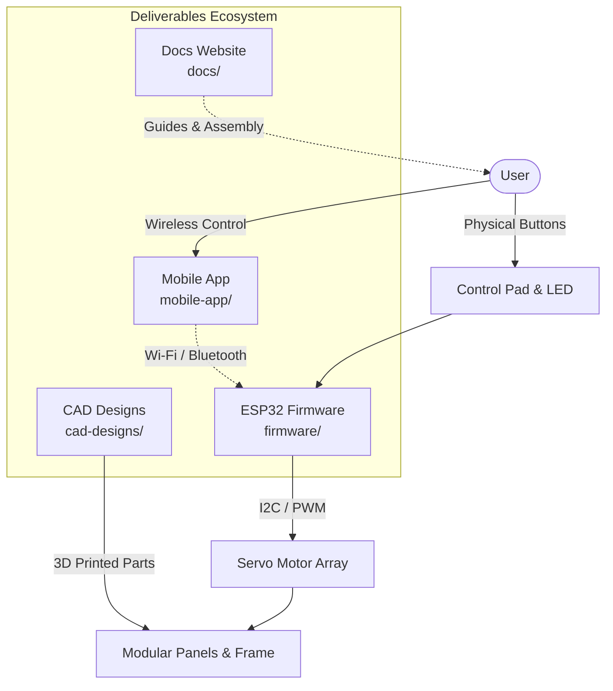

# Fabrica - Cloth Folding Robot: Mission Specification

## Vision & Executive Summary

**Fabrica** is an open-source, end-to-end automated laundry folding system. The core mission of this project is to build and deliver a complete open-source hardware and software ecosystem—spanning **3D CAD designs**, **ESP32 firmware**, **a comprehensive documentation website**, and **a wireless mobile application**—that enables anyone to build, program, and operate a smart cloth folding robot for $80–$150.

Using a customizable grid of hinged 3D-printed panels and intelligent parallel servo motor actuation, Fabrica folds garments (such as t-shirts, towels, and trousers) in 8 to 12 seconds per item with a single button press or mobile app tap.

---

## Core Mission Deliverables

The Fabrica mission encompasses four primary, interconnected project deliverables:

1. **CAD Designs (`cad-designs/`)**:
   - Parametric 3D CAD models and STL/STEP export files for all modular panel types (Motorized, Follower, Base, Interface).
   - Engineered hinge linkages, drive shafts, servo couplers, and controller housing enclosures optimized for FDM 3D printing (PLA/PETG).

2. **Embedded Firmware (`firmware/`)**:
   - Production-grade MicroPython / C++ firmware executing autonomously on the **ESP32**.
   - Driver integration for PCA9685 16-channel PWM servo driver over I2C, 4-button polling interface with debouncing, LED status feedback, parallel motor step execution, and non-volatile Flash memory storage.

3. **Documentation Website (`docs/`)**:
   - A modern, interactive web-based documentation portal providing step-by-step 3D assembly guides, electrical wiring schematics, an interactive Bill of Materials (BOM), operation manuals, and troubleshooting flows.

4. **Mobile Application (`mobile-app/`)**:
   - A cross-platform mobile application providing wireless (Wi-Fi/Bluetooth LE) connectivity to the ESP32.
   - Enables visual sequence creation, pattern management, live telemetry/diagnostics, remote control, and a foundation for future AI-powered garment vision recognition.

---

## High-Level System Architecture

---

## Core Mission Pillars & System Goals

1. **Accessibility & Affordability**: Enable makers, STEM programs, and hobbyists to build a functional laundry robot for **$80–$150** using off-the-shelf components, standard 3D-printed parts, and affordable microcontrollers.
2. **Modular & Scalable Mechanical Design**: Support customizable grid arrangements (2×2, 4×3 standard, 4×4, 5×5, 6×6, or custom non-square layouts) supporting up to **16 motorized modules** paired with follower and base panels.
3. **Dual Operating Modes**: Standalone computer-free operation via physical button interface alongside full wireless control via the mobile application.
4. **Fluid Parallel Motion Execution**: Synchronized multi-motor execution allowing opposite panel flips to occur simultaneously, producing human-like motion and reducing cycle time by ~40%.
5. **Ecosystem & AI Expansion**: Provide a foundation for wireless mobile app connectivity (Wi-Fi/Bluetooth) and future AI-powered fabric/garment vision recognition.

---

## Product Roadmap

- [ ] **Deliverable 1: CAD Designs**: Modular 3D printed panel models, drive shafts, hinge links, controller housing, and full 4×3 grid assembly models.
- [ ] **Deliverable 2: ESP32 Firmware**: MicroPython/C++ firmware, PCA9685 I2C driver, polling 4-button interface, status LED driver, parallel sequence executor, and Flash profile storage.
- [ ] **Deliverable 3: Documentation Website**: Step-by-step mechanical assembly guides, wiring schematics, interactive BOM table, and user manuals.
- [ ] **Deliverable 4: Mobile Application**: Bluetooth LE / Wi-Fi wireless control, visual folding sequence editor, live telemetry, and AI vision preparation.

---

## Reference Visuals & Diagrams

The reference images located in [reference-images](./reference-images) document the system hardware, modules, and architecture:

- **System Overview & 3D Assembly**:
  - [3d-overview.png](./reference-images/3d-overview.png) - 3D CAD Overview of the assembled folding grid.
  - [fabrica-overview.png](./reference-images/fabrica-overview.png) - Assembled hardware unit overview.
  - [fabrica-architecture.png](./reference-images/fabrica-architecture.png) - Hardware and system architecture diagram.

- **Modular Components**:
  - [motorized-module.png](./reference-images/motorized-module.png) - Motorized module panel assembly with servo mount.
  - [follower-module.png](./reference-images/follower-module.png) - Passive follower hinged panel module.
  - [base-module.png](./reference-images/base-module.png) - Stationary structural base module.
  - [interface-module.png](./reference-images/interface-module.png) - Control pad and visual feedback interface module.

- **Controller**:
  - [rasberrypi-pico-2w.png](./reference-images/rasberrypi-pico-2w.png) - Microcontroller hardware reference.
